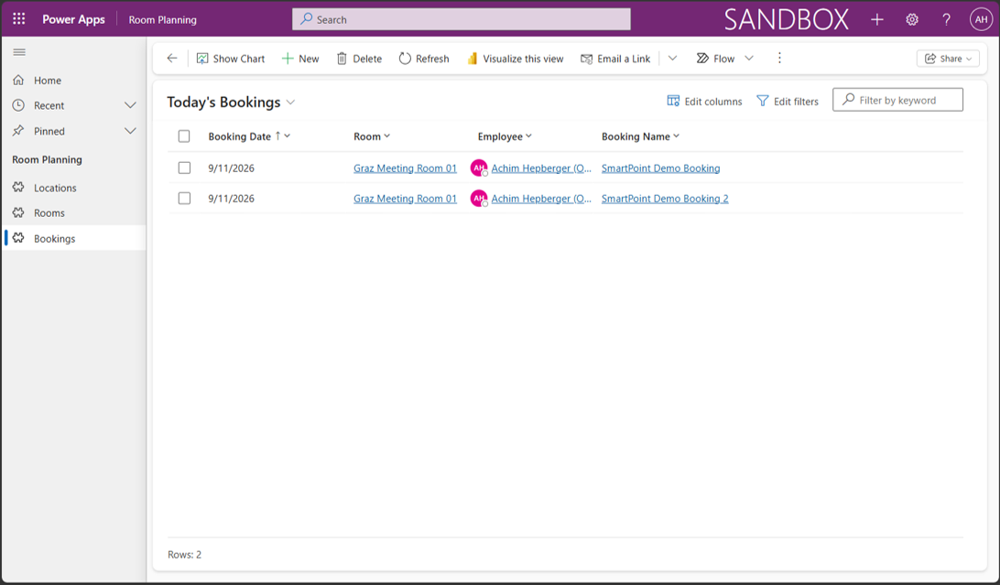

# 1. Room Planning

## 1. Original Requirement

Support multiple office locations containing rooms with different capacities, whole-day employee bookings, and a daily booking/occupancy overview. Offices are conceptually occupied up to 50%; custom overbooking validation or programming is not required.

## 2. Case in One Sentence

Dataverse tables and the Room Planning model-driven app support whole-day employee room bookings and a daily overview with an informational 50% planning limit.

## 3. What We Built

Location, Room and Booking Dataverse tables in unmanaged solution `Achim Beispiel`, environment `CRM816895`, and the `Room Planning` model-driven app. Its navigation exposes Locations, Rooms and Bookings; User is deliberately not exposed. The Employee lookup works without a User navigation item. Planning Capacity expresses the intended 50% limit as information.

## 4. Where to Find It

- **Daily booking overview:** Power Apps → environment `CRM816895` → app `Room Planning` → Bookings → view `Today's Bookings`.
- **Location:** Room Planning → Locations → `Active Locations` → `Graz`.
- **Room capacity:** Room Planning → Rooms → `Active Rooms` → locate `Graz Meeting Room 01`; compare Maximum Capacity `10` and Planning Capacity `5`.
- **Booking records:** Room Planning → Bookings → `Active Bookings` for the general overview, or select `Today's Bookings` for the current day. Booking records use Booking Name, Booking Date, Room and Employee.
- **Implementation in the maker portal:** Power Apps maker portal → environment `CRM816895` → Solutions → `Achim Beispiel` → relevant table (Location, Room or Booking) or the `Room Planning` app.
- **Repository reference:** [PROJECT_PLAN.md — model and evidence](../../PROJECT_PLAN.md).

## 5. How It Works

| Table | Primary column | Fields and relationships |
| --- | --- | --- |
| Location | Location Name | One Location contains many Rooms. Test location: `Graz`. |
| Room | Room Name | Required Location lookup; required Whole Number Maximum Capacity and Planning Capacity, both minimum 1. One Room has many Bookings. |
| Booking | Booking Name | Required Date Only Booking Date, Room lookup and Employee lookup to User (`systemuser`). One User has many Bookings. |

A Location contains Rooms; each Room receives Bookings; each Booking references an Employee/User. Separate tables keep location and room details reusable across bookings. Employee references the existing managed Dataverse User table; this project did not create it. Booking Date is Date Only because each reservation covers a whole day, without start/end times.

Maximum Capacity represents the physical/normal room capacity; Planning Capacity represents the business planning target. For `Graz Meeting Room 01` in `Graz`, 10 maximum and 5 planning places implement the requested conceptual 50% rule. Separate fields preserve both the real room capacity and the current planning policy instead of replacing one value with the other. Planning Capacity is informational and is not enforced.

| View | Included columns / behavior |
| --- | --- |
| Active Locations | Location Name |
| Active Rooms | Room Name, Location, Maximum Capacity, Planning Capacity |
| Active Bookings | Booking Date, Room, Employee, Booking Name |
| Today's Bookings | Description: "Shows active room bookings for the current day." Filters active bookings where Booking Date is today; Booking Date is sorted ascending. |

## 6. Result and Verification

COMPLETED to the extent required for the SmartPoint case.

- The running app, navigation and basic booking creation were functionally tested.
- Today's Bookings showed a current-day booking and excluded a following-day booking.
- The test room has Maximum Capacity `10` and Planning Capacity `5`. A sixth same-day booking was successfully saved, confirming that Planning Capacity is informational and not enforced.

Multiple locations are supported by the model but were not separately demonstrated with multiple test locations.

## 7. Offline Evidence

Evidence status: AVAILABLE — two supplied runtime screenshots. Use dedicated demonstration data and avoid unnecessary personal information.

**Room/capacity model:** The running app's Active Rooms view shows `Graz Meeting Room 01`, location `Graz`, Maximum Capacity `10` and Planning Capacity `5`.

**Daily booking runtime view:** Captured on `2026-09-11`, Today's Bookings shows two current-day records dated `2026-09-11`, with Booking Date, Room, Employee and Booking Name. The separate functional test established that another day's booking was excluded.

**Demo note:** Today's Bookings is date-dependent; for a future live demonstration, create or retain a booking for the actual demonstration date.

See the [evidence instructions](evidence/README.md). A restart/demo rehearsal remains pending.

## 8. Three Real-World Use Cases

Explanatory examples only; these are not additional implemented SmartPoint functionality.

1. Daily desk reservations across office sites.
2. Shared meeting-room booking for internal teams.
3. Training-room planning using room capacity information.

## 9. What I Should Be Able to Explain

- [ ] Explain why Location, Room and Booking are separate tables.
- [ ] Explain the Location → Room → Booking one-to-many relationships.
- [ ] Explain why Employee references the existing User table.
- [ ] Explain why Date Only represents a whole-day reservation.
- [ ] Explain why Maximum Capacity and Planning Capacity are separate fields.
- [ ] Explain how 10 maximum / 5 planning represents the 50% requirement.
- [ ] Explain Today's Bookings: active bookings, today's date and ascending Booking Date.
- [ ] Explain why informational Planning Capacity allows a sixth booking.
- [ ] Explain why custom overbooking validation is deliberately outside scope.
- [ ] Navigate to the runtime app and the solution in the maker portal.

## 10. Troubleshooting and Important Notes

- Prepare current-date demo data before showing Today's Bookings; bookings for other dates will not appear.
- Planning Capacity is informational, so a booking above the planning number is expected to save.
- User does not need to appear in app navigation for the Employee lookup to work.
- The project deliberately contains no custom overbooking validation because the SmartPoint case does not require it. This is an intentional scope decision.

[Back to Case Guide](README.md)
