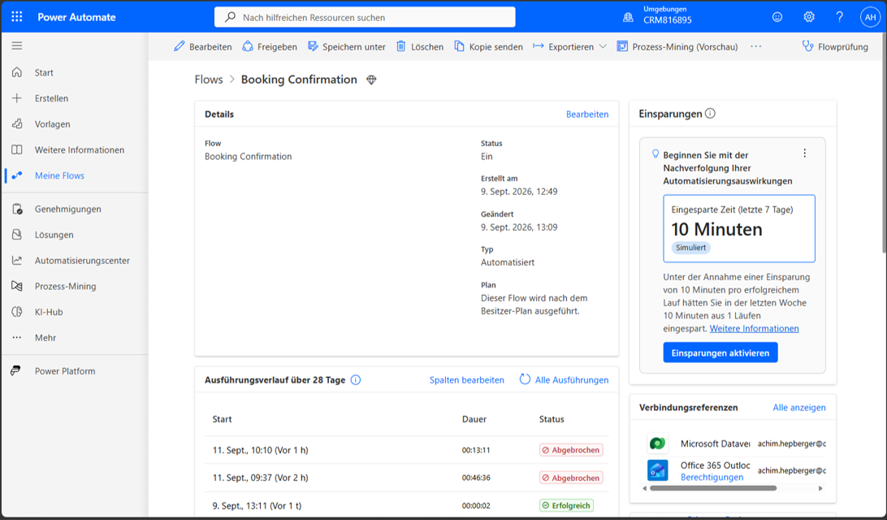
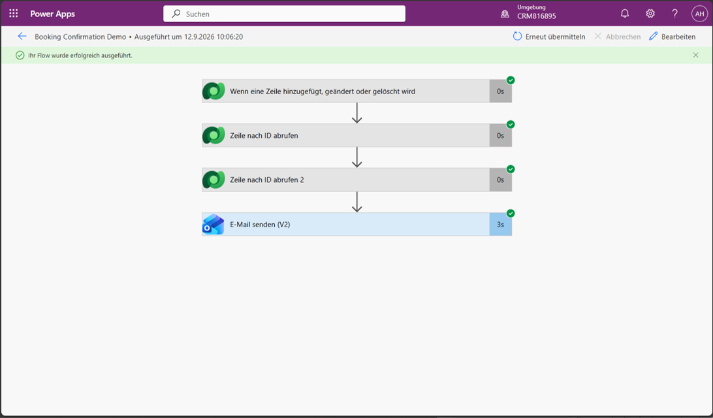
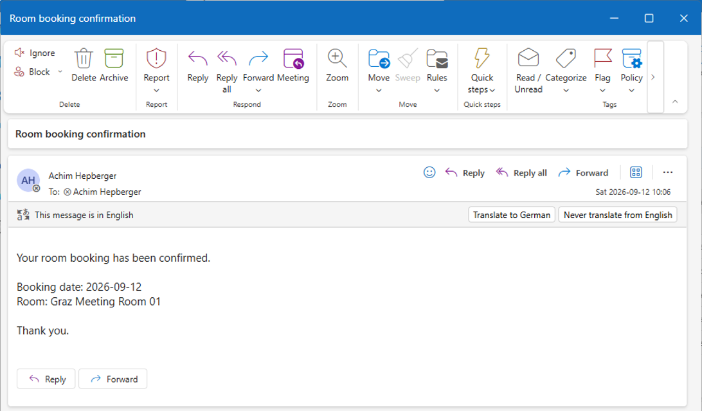

# 2. Booking Confirmation

## 1. Original Requirement

When a booking is created, send the employee a confirmation email for the booked day.

## 2. Case in One Sentence

Power Automate turns a new Dataverse Booking into an Outlook confirmation email containing the booked date and room.

## 3. What We Built

The `Booking Confirmation` Power Automate flow in environment `CRM816895` retrieves the related employee and room, then sends a confirmation through Office 365 Outlook. The unmanaged solution `Achim Beispiel` contains exactly one `Booking Confirmation` cloud flow, and it is enabled. This is the verified replacement flow after the connection recovery described below.

## 4. Where to Find It

- **Flow overview:** Power Automate → environment `CRM816895` → My flows (`Meine Flows`) → `Booking Confirmation`.
- **Solution:** Power Apps Maker → environment `CRM816895` → Solutions → `Achim Beispiel` → cloud flow `Booking Confirmation`.
- **Edit:** From the overview, select Edit (`Bearbeiten`) to inspect the trigger and actions.
- **Run history:** On the overview, find the 28-day run history (`Ausführungsverlauf über 28 Tage`); use All runs (`Alle Ausführungen`) for the full list. Select a run to inspect its steps. The final successful run was on `2026-09-12`; its screenshot shows the temporary pre-rename name `Booking Confirmation Demo`. The current flow name is `Booking Confirmation`.
- **Run details:** Open an action to inspect its inputs and outputs. Green check marks indicate successful steps; inspect the action status and error when a run fails or keeps retrying.
- **Flow checker:** Select `Flowprüfung` on the overview to check configuration errors and warnings.
- **Connections:** The overview's Connection references (`Verbindungsreferenzen`) panel lists Microsoft Dataverse and Office 365 Outlook; use Show all (`Alle anzeigen`) to inspect the references. Inspect the associated Dataverse connection and the flows using it when troubleshooting.
- **Triggering record:** Power Apps → `CRM816895` → app `Room Planning` → Bookings.
- **Business result:** Open the employee's Microsoft 365 mailbox and find subject `Room booking confirmation`.
- **Repository reference:** [PROJECT_PLAN.md — flow configuration and troubleshooting](../../PROJECT_PLAN.md).

## 5. How It Works

A Booking contains lookups to Employee/User and Room. These references identify related records; the flow retrieves those records to use the related employee and room data needed for the confirmation.

1. **Microsoft Dataverse trigger — When a row is added, modified or deleted:** reacts to creation of a Booking. Booking Date comes from this record.
2. **Dataverse — Get a row by ID:** retrieves the Employee/User referenced by the Booking. This makes the related employee data available for the confirmation.
3. **Dataverse — Get a row by ID:** retrieves the referenced Room. This makes the related room data available for the confirmation email.
4. **Office 365 Outlook — Send an email (V2):** sends subject `Room booking confirmation`, confirmation text, the booking date and room name.

In the German runtime screenshot these steps are labelled `Wenn eine Zeile hinzugefügt, geändert oder gelöscht wird`, `Zeile nach ID abrufen`, `Zeile nach ID abrufen 2` and `E-Mail senden (V2)`.

Dataverse provides the event and business data; Office 365 Outlook delivers the message. The two retrieval actions resolve the employee and room relationships before the email is sent.

## 6. Result and Verification

COMPLETED and VERIFIED. On `2026-09-12`, test Booking `Booking Confirmation Demo Test`, Booking Date `2026-09-12`, room `Graz Meeting Room 01`, employee Achim Hepberger, triggered all four stages successfully in the replacement flow. The run displays `Ihr Flow wurde erfolgreich ausgeführt.` The confirmation email was received with subject `Room booking confirmation` and this body:

```text
Your room booking has been confirmed.

Booking date: 2026-09-12
Room: Graz Meeting Room 01

Thank you.
```

This verifies Booking creation → flow execution → related data retrieval → confirmation email received. After successful verification, the replacement was renamed from `Booking Confirmation Demo` to `Booking Confirmation`. The original flow was deactivated and deleted; the solution now contains exactly one enabled Booking Confirmation flow.

## 7. Offline Evidence

Evidence status: AVAILABLE — two final runtime screenshots from 2026-09-12 and one historical overview. Use dedicated demonstration data and avoid unnecessary personal information.



**Historical flow overview:** Shows the original flow in `CRM816895`, status On, required connection references and the successful `2026-09-09 13:11` run. The two cancelled September 11 runs relate to the troubleshooting incident below. This overview predates replacement and is not evidence of the current flow inventory.



**Final runtime execution (2026-09-12):** The success banner and four green check marks show that the trigger, both Dataverse retrievals and Outlook email action completed successfully. The screenshot was captured before the replacement was renamed from `Booking Confirmation Demo` to its final name `Booking Confirmation`.



**Business result:** The received Outlook message shows the subject, recipient, booking date, room and `2026-09-12 10:06` timestamp. It confirms delivery beyond the successful action status.

See the [evidence instructions](evidence/README.md). A restart/live demo rehearsal remains pending.

## 8. Three Real-World Use Cases

Explanatory examples only; these are not additional implemented SmartPoint functionality.

1. Send a service-request receipt after a record is created.
2. Confirm an equipment reservation to its requester.
3. Notify an employee that a training registration was saved.

## 9. What I Should Be Able to Explain

- [ ] Explain what triggers Booking Confirmation and outline its four steps.
- [ ] Explain why related Employee/User data is retrieved for the confirmation.
- [ ] Explain why related Room data is retrieved for the confirmation.
- [ ] Identify the recipient, booking date and room in the received email.
- [ ] Explain Dataverse's data role versus Outlook's delivery role.
- [ ] Explain why the successful run and received email establish end-to-end success.
- [ ] Navigate to the flow overview, run history and a specific run.
- [ ] Interpret green/successful steps versus retrying or failed actions.
- [ ] Explain hostname troubleshooting without assuming a business-data error.

## 10. Troubleshooting and Important Notes

**Working mail connector:** Use Office 365 Outlook `Send an email (V2)`. Earlier setup encountered an XRM metadata/connectivity issue and a separate new-tenant restriction on the generic Mail V3 action.

**Recognizing a hostname problem:** During a retest, the first Get a row by ID reported `UnresolvableHostName`, `HostNotFound` and `No such host is known`, despite valid-looking inputs: `entityName=systemusers`, `recordId=beb96a80-5bab-f111-aaac-7c1e5240ac7b`, connection reference `shared_commondataserviceforapps`. The stale hostname `org96048834.crm3.dynamics.com` differed from the current environment URL, `https://oebb-stoerungsmanagement.crm3.dynamics.com`. This pointed toward connection/backend/discovery trouble, not immediate proof of bad Booking/User data.

**Verified recovery (2026-09-12):** The business logic was already known to work from the earlier successful run. Inspecting the existing connection showed Connected, but Switch account (`Konto wechseln`), reauthentication and saving did not resolve the stale-host behavior. Creating a fresh flow copy and rebinding its Dataverse connections resolved the issue, as confirmed by the successful end-to-end replacement test. After verification, `Booking Confirmation Demo` was renamed to `Booking Confirmation`. The problematic original was deactivated and deleted. No more specific internal Power Platform root cause is established.

The earlier Flow checker result was 0 errors and 0 warnings; that did not establish runtime connectivity. Two obsolete retrying runs from `2026-09-11` were cancelled. The recovery concerns connection/runtime behavior, not a demonstrated defect in the booking-confirmation logic.

**If a Dataverse step unexpectedly retries or reports a hostname error:**

1. Inspect the failed action's table and record ID before assuming Booking/User data is wrong.
2. Inspect the Dataverse connection used by Booking Confirmation and its authentication/connection status.
3. Reauthenticate if appropriate, but if stale-host behavior persists, the verified recovery was a fresh copy with rebound Dataverse connections. Verify the replacement end-to-end before treating recovery as complete.
4. Use Flow checker to check configuration errors and warnings; it does not prove runtime connectivity.
5. Retest with a fresh Booking, inspect the run and confirm actual email receipt.
6. Cancel obsolete retrying runs if necessary.

For a live demonstration, use a Booking with the intended employee and room and access to the recipient's mailbox. Creating a Booking sends a real confirmation email.

[Back to Case Guide](README.md)
