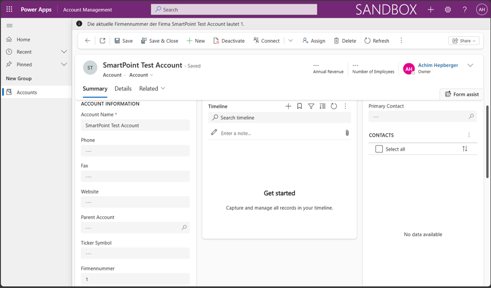
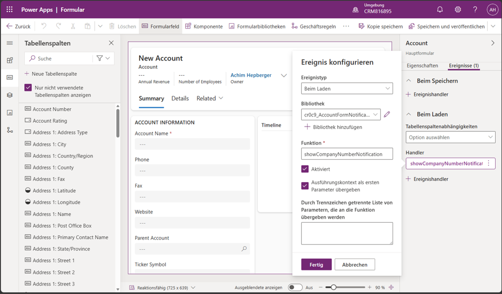

# 3. JavaScript Account Form Notification

## 1. Original Requirement

On Account form load, show a form notification containing the current company name and company number, using the message concept `Die aktuelle Firmennummer der Firma **Firmenname** lautet **Firmennummer**.` The placeholders are replaced with actual values; the asterisks indicate placeholders here, not bold formatting in the runtime notification.

## 2. Case in One Sentence

An Account form OnLoad JavaScript handler displays the current Account name and company number in an INFO notification for the user opening the record.

## 3. What We Built

In environment `CRM816895`, unmanaged solution `Achim Beispiel` contains the Account customization: the text/string column `Firmennummer` (`cr0c9_firmennummer`) and JavaScript web resource `Account Form Notification` (`cr0c9_AccountFormNotification.js`). The Account main form includes Firmennummer and registers `showCompanyNumberNotification` on OnLoad, enabled and passing execution context. The form was saved and published.

The published, minimal `Account Management` model-driven app provides the Account runtime UI separately from Room Planning. Dataverse stores the data, the form provides the current record context, and JavaScript builds and displays the notification. The script does not assign or persist company numbers.

## 4. Where to Find It

- **Runtime:** Power Apps → environment `CRM816895` → Apps → `Account Management` → Accounts → open an Account. Use `SmartPoint Test Account` for the recorded demonstration.
- **OnLoad configuration:** Power Apps Maker → `CRM816895` → Solutions → `Achim Beispiel` → Tables (`Tabellen`) → Account → Forms (`Formulare`) → Account main form → Events (`Ereignisse`) → OnLoad (`Beim Laden`) → handler `showCompanyNumberNotification`.
- **Handler details:** Open the handler and check event type OnLoad (`Beim Laden`), library `cr0c9_AccountFormNotification.js`, function `showCompanyNumberNotification`, Enabled (`Aktiviert`), and execution context passed as the first parameter (`Ausführungskontext als ersten Parameter übergeben`).
- **Web resource:** In solution `Achim Beispiel`, locate the JavaScript web resource by display name `Account Form Notification` or name `cr0c9_AccountFormNotification.js`. The form designer also exposes Form libraries (`Formularbibliotheken`) for the registered library.
- **Column:** In the solution's Account table, locate column `Firmennummer`; confirm logical name `cr0c9_firmennummer` and text/string type. The field is also visible on the Account main form.
- **Local source:** Repository → `src/javascript/` → [AccountFormNotification.js](../../src/javascript/AccountFormNotification.js).
- **Status and verification:** [PROJECT_PLAN.md](../../PROJECT_PLAN.md).

## 5. How It Works

The [repository source](../../src/javascript/AccountFormNotification.js) implements these steps:

1. `showCompanyNumberNotification(executionContext)` runs on form OnLoad. `executionContext.getFormContext()` obtains the form that raised the event, so execution context must be passed by the handler registration.
2. `formContext.getAttribute("name")` retrieves Account Name; `getAttribute("cr0c9_firmennummer")` retrieves Firmennummer. Logical names identify attributes in code, independently of their display labels.
3. `getValue()` reads each current form value. A missing attribute is treated as `null`. The company number is read from the form, not hard-coded in JavaScript.
4. If either value is null, empty or whitespace-only, `formContext.ui.clearFormNotification("companyNumberNotification")` clears this notification and the function returns without displaying an incomplete sentence. Zero is treated as a supplied value.
5. Otherwise, the function joins the current name and number into the required sentence and calls `formContext.ui.setFormNotification(message, "INFO", notificationId)`.

The stable notification ID `companyNumberNotification` identifies this message, allowing the script to clear it specifically. The handler reads the current form values when OnLoad runs; it does not continuously watch field edits or background Dataverse updates.

## 6. Result and Verification

COMPLETED and VERIFIED. In `Account Management`, `SmartPoint Test Account` currently shows Firmennummer `1` and the matching notification:

```text
Die aktuelle Firmennummer der Firma SmartPoint Test Account lautet 1.
```

The visible field and notification values match. Earlier verification used `4711`; later account-numbering work changed the Dataverse value to `1`. The current runtime result and source demonstrate that the notification uses the current form value rather than a hard-coded company number.

The Account main form's OnLoad configuration is verified: correct library/function, handler enabled, execution context passed, and form saved and published. The source code explicitly handles missing or empty values by clearing the notification and returning without displaying an incomplete message. No separate Power Apps runtime test of empty values is claimed.

## 7. Offline Evidence

Evidence status: AVAILABLE — two screenshots showing the runtime result and OnLoad configuration. Use dedicated demonstration data and avoid unnecessary personal information.



**Runtime result:** Account Management shows `SmartPoint Test Account`, Firmennummer `1`, and the notification with the same company name and number.



**OnLoad registration:** The Account main form designer shows OnLoad (`Beim Laden`), the selected JavaScript library, `showCompanyNumberNotification`, Enabled and execution context passed as the first parameter.

See the [evidence instructions](evidence/README.md). Documentation awaits user review; restart/live demo rehearsal remains pending.

## 8. Three Real-World Use Cases

Explanatory examples only; these are not additional implemented SmartPoint functionality.

1. Show a customer reference number to service staff when they open an Account.
2. Display a contextual account-handling reminder on form load.
3. Highlight a missing business identifier to a data steward.

## 9. What I Should Be Able to Explain

- [ ] Explain what triggers the JavaScript and where OnLoad is configured.
- [ ] Explain executionContext, formContext and why context must be passed.
- [ ] Explain where Account Name and Firmennummer values come from.
- [ ] Explain why code uses `name` and `cr0c9_firmennummer`, not display labels.
- [ ] Explain how the sentence is constructed and displayed as INFO.
- [ ] Explain the stable notification ID and targeted clearing.
- [ ] Explain what happens when an attribute or required value is missing.
- [ ] Locate the web resource, source file and enabled OnLoad handler.
- [ ] Demonstrate the matching field and notification values in Account Management.
- [ ] Distinguish Dataverse data storage from client-side form behavior.

## 10. Troubleshooting and Important Notes

**If the notification does not appear:**

1. Open the intended Account main form in Account Management. Check that Account Name and Firmennummer are present and nonempty; blank values deliberately suppress the message.
2. Follow the configuration path in section 4. Confirm OnLoad, library `cr0c9_AccountFormNotification.js`, function `showCompanyNumberNotification`, handler enabled and execution context passed. Without context, the function cannot obtain formContext.
3. Compare the deployed web resource with the repository source. Check logical names `name` and `cr0c9_firmennummer`; using the display label `Firmennummer` in `getAttribute` will not retrieve the intended attribute.
4. Save and publish any web-resource/form corrections. Reopen or reload the form to avoid stale browser/form state and run OnLoad again.

**Live demo:** Open `SmartPoint Test Account` and compare the visible Firmennummer with the notification. The current verified value is `1`; `4711` belongs to earlier testing. Console and timer numbering can change the same Dataverse field. Stop the local timer before demonstrating a fixed value, then reopen the form to read the current data. This task does not claim an OnChange handler or automatic refresh after a background update.

[Back to Case Guide](README.md)
