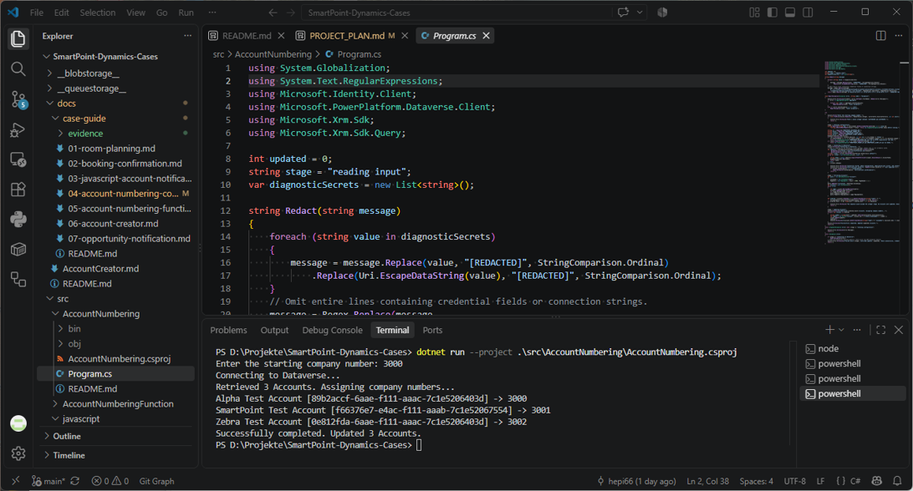
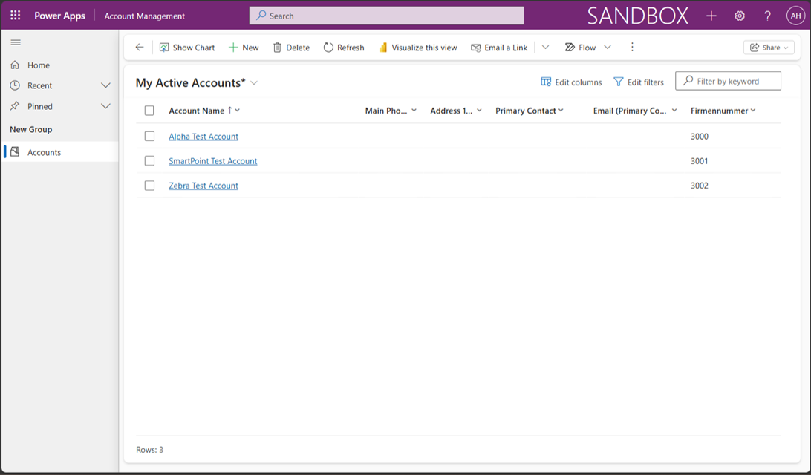

# 4. C# Account Numbering Console

## 1. Original Requirement

Ask for a starting company number, read all Accounts through the .NET/Dataverse SDK, process them alphabetically, assign sequential numbers beginning with the supplied start, and store each result in Firmennummer.

## 2. Case in One Sentence

A C# Dataverse SDK console application numbers Accounts alphabetically from a user-supplied starting number and persists each number as text.

## 3. What We Built

A small `net10.0` console application using `Microsoft.PowerPlatform.Dataverse.Client` 1.2.27 and `System.Security.Cryptography.Xml` 10.0.10. It retrieves Accounts with paging, sorts them deterministically and performs individual Dataverse updates. Case 04 receives its starting number from the user, unlike Case 05's fixed starting-number requirement.

MSAL application authentication supplies tokens to Dataverse `ServiceClient`. The working Entra registration is `SmartPoint Dataverse Integration 2`, with an active Dataverse Application User in `CRM816895`. The System Administrator role is the current case/demo configuration; production should use appropriately scoped permissions.

## 4. Where to Find It

- **Project:** Repository → `src/AccountNumbering/` → [AccountNumbering.csproj](../../src/AccountNumbering/AccountNumbering.csproj), containing the target framework and package references.
- **Logic:** [Program.cs](../../src/AccountNumbering/Program.cs), containing input, authentication, retrieval, numbering and diagnostics.
- **Build and technical reference:** [component README](../../src/AccountNumbering/README.md), including build commands and authentication troubleshooting.
- **Persisted result:** Power Apps → `CRM816895` → Apps → `Account Management` → Accounts. Inspect the Account list with Account Name ascending and Firmennummer visible: `Alpha Test Account` = `3000`, `SmartPoint Test Account` = `3001`, `Zebra Test Account` = `3002`.

**Fresh PowerShell terminal workflow:** On the verified local .NET setup, run the following from a new terminal. The URL, tenant ID and client ID below are the verified non-secret configuration; enter the secret only at the masked prompt.

```powershell
cd D:\Projekte\SmartPoint-Dynamics-Cases
$env:SMARTPOINT_DATAVERSE_URL = "https://oebb-stoerungsmanagement.crm3.dynamics.com"
$env:SMARTPOINT_TENANT_ID = "9573d76d-ef51-494d-8586-a29c47e01e1e"
$env:SMARTPOINT_CLIENT_ID = "84678431-d576-4760-9882-89e604db9df1"
$secret = Read-Host "Client secret" -AsSecureString
$env:SMARTPOINT_CLIENT_SECRET = [System.Net.NetworkCredential]::new("", $secret).Password

"URL: $([bool]$env:SMARTPOINT_DATAVERSE_URL) | Tenant: $([bool]$env:SMARTPOINT_TENANT_ID) | Client: $([bool]$env:SMARTPOINT_CLIENT_ID) | Secret: $([bool]$env:SMARTPOINT_CLIENT_SECRET)"

dotnet run --project .\src\AccountNumbering\AccountNumbering.csproj
```

Expected presence check: `URL: True | Tenant: True | Client: True | Secret: True`. These variables identify the Dataverse organization, Entra tenant, application identity and its secret. They are process/session environment variables inherited by the launched console; a fresh terminal or machine restart may require setting them again. True means present, not valid.

The secret is converted for the process environment without printing it. Never paste its value into source, documentation or committed files. The application does not load `.env` files. These variables are session/process scoped; closing the terminal ends that local session. If `dotnet` is not on PATH, the component README provides commands using `C:\Program Files\dotnet\dotnet.exe`.

## 5. How It Works

The implementation in [Program.cs](../../src/AccountNumbering/Program.cs) follows these stages:

1. Ask the user for only one starting number and parse it as a signed 32-bit integer. Invalid input stops the program.
2. Require all four environment variables; validate an HTTPS organization root URL and GUID-formatted tenant/client IDs.
3. Use MSAL client credentials against the configured tenant to obtain an application token. `ServiceClient` uses it for authenticated SDK operations and is checked with `IsReady`.
4. Build a `QueryExpression("account")` requesting `name`, with Account ID ordering and pages of 5,000. `RetrieveMultiple` returns `Entity` records; continue while `MoreRecords` is true, incrementing the page number and carrying the paging cookie. All accessible Accounts are included, with no active-only filter.
5. Sort the collected Accounts by name using `StringComparer.InvariantCultureIgnoreCase`, then by Account ID. Missing names sort as empty strings; the ID gives consistent ordering for equal names. Retrieval ID order and final alphabetical order serve different purposes.
6. Check that the full sequence fits the integer range before writing. The first current number equals the supplied start: the code computes each number as start plus the confirmed-update count, initially zero.
7. Create an `Entity("account", account.Id)` containing only `cr0c9_firmennummer`, then call `client.Update`. Convert the number to an invariant-culture string because Firmennummer is a text column. After a successful update, increment the count, so the next Account receives the next number.
8. Print each Account name/ID and assigned number, followed by the final updated count.

The SDK represents records as `Entity` objects; `Update` persists the specified attribute to the existing Account. Existing company numbers are overwritten. Updates are individual operations, not one transaction: a later failure does not roll back earlier writes.

## 6. Result and Verification

COMPLETED and functionally VERIFIED. The final test used three Accounts and only one user-supplied starting number, `3000`. Console output (Account IDs omitted for readability):

```text
Enter the starting company number: 3000
Connecting to Dataverse...
Retrieved 3 Accounts. Assigning company numbers...
Alpha Test Account -> 3000
SmartPoint Test Account -> 3001
Zebra Test Account -> 3002
Successfully completed. Updated 3 Accounts.
```

This verifies starting-number input, multi-Account retrieval, alphabetical processing, automatically generated sequential numbers and successful Dataverse updates. The user did not enter `3001` or `3002`; the program generated them after the first assignment.

Account Management subsequently displayed the same persisted mapping, with Account Name ascending and Firmennummer visible:

| Account Name | Firmennummer |
| --- | --- |
| Alpha Test Account | 3000 |
| SmartPoint Test Account | 3001 |
| Zebra Test Account | 3002 |

The console establishes processing order and successful updates; the Account list confirms the stored values. Paging remains implemented in source, but this three-record test does not exercise multiple retrieval pages. Earlier restore and Release build validation passed without warnings or errors; no new execution is claimed by this documentation task.

## 7. Offline Evidence

Evidence status: AVAILABLE — two screenshots showing the console run and persisted Dataverse result. Use dedicated demonstration data and avoid unnecessary personal information; never include secret values or environment dumps.



**Console execution:** Shows the repository/project context, Program.cs, one starting number `3000`, connection, three retrieved Accounts in alphabetical order, assignments `3000`, `3001`, `3002` and successful completion with three updates.



**Persisted result:** Account Management shows Account Name in ascending order and the Firmennummer column: `Alpha Test Account` = `3000`, `SmartPoint Test Account` = `3001`, `Zebra Test Account` = `3002`. All three console assignments are visible in Dataverse.

See the [evidence instructions](evidence/README.md). Documentation awaits user review. The recorded fresh-terminal verification succeeded; the separately tracked demo rehearsal remains pending.

## 8. Three Real-World Use Cases

Explanatory examples only; these are not additional implemented SmartPoint functionality.

1. Assign legacy customer references during a migration.
2. Perform a controlled one-off master-data correction.
3. Populate identifiers before an integration handover.

## 9. What I Should Be Able to Explain

- [ ] Explain why a console suits a manually controlled batch maintenance task.
- [ ] Explain ServiceClient, QueryExpression, Entity and SDK Update operations.
- [ ] Explain Entra credentials, the Dataverse Application User and its security role.
- [ ] Explain the four environment variables and why secrets stay out of source.
- [ ] Restore session configuration after opening a fresh terminal.
- [ ] Explain Account retrieval and why paging is necessary.
- [ ] Explain case-insensitive alphabetical sorting and the Account ID tie-breaker.
- [ ] Explain why the user enters only one starting number and how the program generates subsequent numbers.
- [ ] Explain the logical name `cr0c9_firmennummer` and string conversion.
- [ ] Explain persistence, overwrite behavior and partial completion on failure.
- [ ] Explain how the three-Account console output demonstrates alphabetical processing and how the Account Management list confirms the persisted mapping.
- [ ] Distinguish Case 04's user-supplied start from Case 05's fixed start.

## 10. Troubleshooting and Important Notes

1. **Missing configuration:** Run the boolean presence check in section 4 in the same terminal that launches the console. Restore missing variables; True only confirms a value exists.
2. **Authentication failure:** Confirm the tenant/client IDs refer to `SmartPoint Dataverse Integration 2` and that the secret belongs to it and has not expired. Re-enter a valid secret through the masked prompt; do not print it.
3. **Connection failure:** Check the HTTPS Dataverse URL and connectivity. Confirm the active Application User maps to the intended Entra application in `CRM816895` and has Account read/write permissions. System Administrator is the case role, not a production least-privilege recommendation.
4. **No Accounts returned:** Check the target environment and application-user access. The program treats zero Accounts as success with zero updates.
5. **Update failure:** Confirm the logical column name `cr0c9_firmennummer`, text type and write permissions. Use the reported stage and confirmed-update count; earlier writes remain, and an interrupted request may already have reached Dataverse. Inspect the data before rerunning.
6. **Diagnostics:** Diagnostic output is designed to redact credential-bearing information and can help identify connection or authentication failures. Never expose secrets or tokens in logs or screenshots.

The earlier `AADSTS700016` error was isolated to an original Entra registration not found in the tenant, before Account access. The replacement registration and corresponding Application User resolved authentication; the text column was not the cause. See [detailed authentication troubleshooting](../../src/AccountNumbering/README.md#authentication-failure-aadsts700016).

**Live demo:** Set environment → run console → enter a memorable start value → observe output → open the Account list in Account Management → verify all three Firmennummer values. Running with valid credentials updates Accounts immediately. Stop any local numbering function and avoid concurrent Account changes while demonstrating a fixed result.

[Back to Case Guide](README.md)
