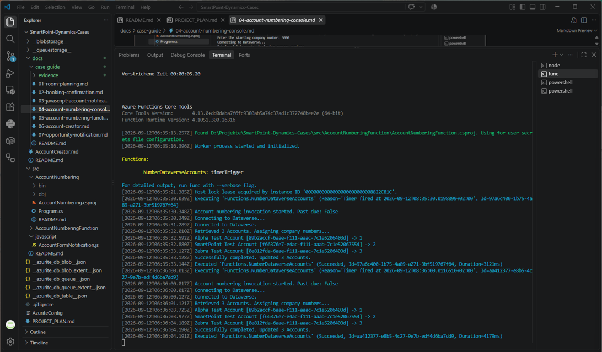
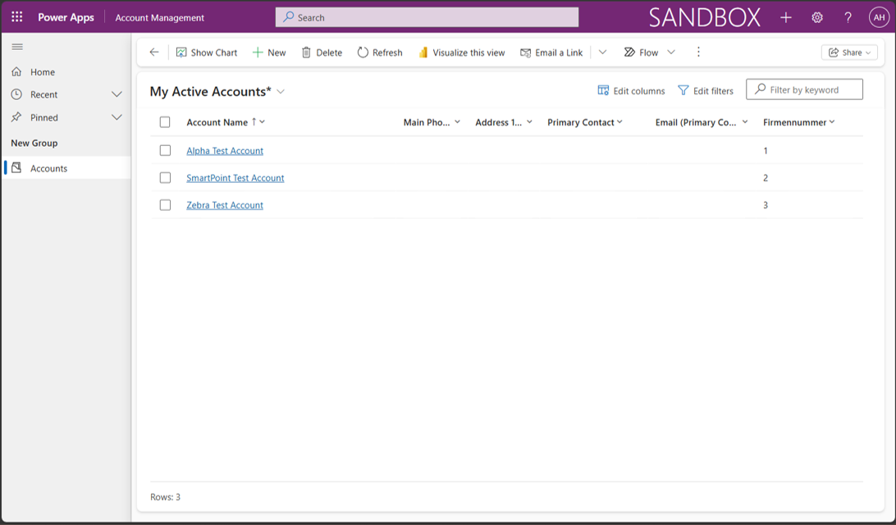

# 5. Timer-triggered Account Numbering Function

## 1. Original Requirement

Use a timer-triggered Azure Function with OAuth/application-user authentication to read Accounts, process them alphabetically, assign sequential Firmennummer values starting at 1, and overwrite existing numbers on every invocation. Local execution satisfies the case; Azure deployment is not required.

## 2. Case in One Sentence

A locally run timer-triggered Azure Function overwrites Account company numbers in alphabetical order, restarting at 1 on every invocation.

## 3. What We Built

An Azure Functions v4 `net10.0` isolated worker project, adapting the proven Dataverse console approach without a shared library. The isolated worker runs the .NET application separately from the Functions host. There is no interactive input or HTTP trigger, and no Application Insights is required for this local case.

The project uses Azure.Functions.Sdk 1.0.0, Microsoft.Azure.Functions.Worker 2.52.0, Microsoft.Azure.Functions.Worker.Extensions.Timer 4.3.1, Microsoft.PowerPlatform.Dataverse.Client 1.2.27 and System.Security.Cryptography.Xml 10.0.10. Core Tools 4.13.0 and Azurite 3.37.0 were used locally.

Case 04 is manually launched and asks for a starting number; its final test used `3000`. Case 05 is invoked by a timer and always starts at `1`, so overwriting Case 04's `3000/3001/3002` with `1/2/3` is expected behavior.

Authentication uses `SmartPoint Dataverse Integration 2` and its active Dataverse Application User in `CRM816895`. System Administrator is the current case/demo role; production should use appropriately scoped permissions.

## 4. Where to Find It

- **Project:** Repository → `src/AccountNumberingFunction/` → [AccountNumberingFunction.csproj](../../src/AccountNumberingFunction/AccountNumberingFunction.csproj).
- **Timer and Dataverse logic:** [AccountNumberingTimer.cs](../../src/AccountNumberingFunction/AccountNumberingTimer.cs), function `NumberDataverseAccounts`.
- **Worker startup:** [Program.cs](../../src/AccountNumberingFunction/Program.cs).
- **Host configuration:** [host.json](../../src/AccountNumberingFunction/host.json), using the minimal version 2.0 configuration schema for Functions v4.
- **Build/reference commands:** [Function README](../../src/AccountNumberingFunction/README.md), including the full Core Tools executable path if `func` is not on PATH.
- **Persisted result:** Power Apps → `CRM816895` → Apps → `Account Management` → Accounts. Refresh the list and compare Account Name and Firmennummer for the three demonstration Accounts.

**Terminal 1 — start local storage from the repository root:**

```powershell
cd D:\Projekte\SmartPoint-Dynamics-Cases
azurite.cmd
```

Keep this terminal running. Azurite provides Blob at `127.0.0.1:10000`, Queue at `127.0.0.1:10001` and Table at `127.0.0.1:10002`. The `.cmd` executable avoids a blocked npm PowerShell wrapper without weakening execution policy. Azurite runtime artifacts are already excluded by `.gitignore`.

**Terminal 2 — configure and start the Function:**

```powershell
cd D:\Projekte\SmartPoint-Dynamics-Cases
$env:SMARTPOINT_DATAVERSE_URL = "https://oebb-stoerungsmanagement.crm3.dynamics.com"
$env:SMARTPOINT_TENANT_ID = "9573d76d-ef51-494d-8586-a29c47e01e1e"
$env:SMARTPOINT_CLIENT_ID = "84678431-d576-4760-9882-89e604db9df1"
$secret = Read-Host "Client secret" -AsSecureString
$env:SMARTPOINT_CLIENT_SECRET = [System.Net.NetworkCredential]::new("", $secret).Password
$env:AzureWebJobsStorage = "UseDevelopmentStorage=true"
$env:SMARTPOINT_ACCOUNT_NUMBERING_SCHEDULE = "*/30 * * * * *"
$env:FUNCTIONS_WORKER_RUNTIME = "dotnet-isolated"

# Presence only, in this order: URL, Tenant, Client, Secret, Storage, Schedule, Worker.
[bool]$env:SMARTPOINT_DATAVERSE_URL
[bool]$env:SMARTPOINT_TENANT_ID
[bool]$env:SMARTPOINT_CLIENT_ID
[bool]$env:SMARTPOINT_CLIENT_SECRET
[bool]$env:AzureWebJobsStorage
[bool]$env:SMARTPOINT_ACCOUNT_NUMBERING_SCHEDULE
[bool]$env:FUNCTIONS_WORKER_RUNTIME

cd D:\Projekte\SmartPoint-Dynamics-Cases\src\AccountNumberingFunction
func start --dotnet-isolated
```

The presence check should print seven `True` values, never configuration values or secrets. The first four variables configure the Dataverse organization and Entra credentials; AzureWebJobsStorage connects local host storage, the schedule controls invocation times, and FUNCTIONS_WORKER_RUNTIME selects the isolated worker.

These variables are session/process scoped and may need restoring in a fresh terminal or after restart. Enter the secret only through the masked prompt; never put its value in documentation, source or committed configuration. No local.settings.json is required when using the launching shell. Azurite must already be running when storage is set to `UseDevelopmentStorage=true`.

## 5. How It Works

1. `Program.cs` configures the isolated worker with `ConfigureFunctionsWorkerDefaults()` and runs the host. Core Tools discovers `NumberDataverseAccounts: timerTrigger`.
2. The timer reads `%SMARTPOINT_ACCOUNT_NUMBERING_SCHEDULE%`. The six-field local test schedule `*/30 * * * * *` fires every 30 seconds; this short demonstration interval is not a production recommendation. `RunOnStartup=false` prevents an extra invocation just because the host starts; wait for the timer.
3. Each invocation logs its start and past-due status, validates the four authentication variables, and uses MSAL client credentials to supply OAuth tokens to Dataverse `ServiceClient`.
4. A `QueryExpression("account")` retrieves accessible Accounts with `name`, ordered by Account ID during retrieval. Pages contain up to 5,000 records; `MoreRecords`, page number and paging cookie drive subsequent requests.
5. The collected Accounts are sorted by name using invariant-culture, case-insensitive comparison, then by Account ID as a deterministic tie-breaker. Missing names sort as empty strings.
6. The invocation sets `start = 1` and the confirmed-update count to zero. Each number is `start + updated`; no starting-number prompt exists because the case requires a fresh sequence from 1 each time. The sequence is checked against the integer range before writes.
7. Individual SDK `Update` calls overwrite `cr0c9_firmennummer`. Each number is converted to an invariant-culture string because Firmennummer is a text column. After each successful update, the count increments and the assignment is logged.
8. Completion logs the updated count. Failure diagnostics are designed to redact credentials. Updates are not one transaction; earlier successful writes are not automatically rolled back if a later update fails.

## 6. Result and Verification

COMPLETED and functionally VERIFIED. The final local test on `2026-09-12` started with `func start --dotnet-isolated`, Azurite running and `AzureWebJobsStorage=UseDevelopmentStorage=true`. The host discovered `NumberDataverseAccounts: timerTrigger` and a scheduled invocation logged the following (Account IDs and host timing details omitted):

```text
Account numbering invocation started. Past due: False
Connecting to Dataverse...
Connected to Dataverse.
Retrieved 3 Accounts. Assigning company numbers...
Alpha Test Account -> 1
SmartPoint Test Account -> 2
Zebra Test Account -> 3
Successfully completed. Updated 3 Accounts.
Executed 'Functions.NumberDataverseAccounts' (Succeeded ...)
```

A second timer invocation completed successfully with the same assignments. Refreshing Account Management showed the persisted results:

| Account | Before Case 05 (Case 04 result) | After Case 05 |
| --- | --- | --- |
| Alpha Test Account | 3000 | 1 |
| SmartPoint Test Account | 3001 | 2 |
| Zebra Test Account | 3002 | 3 |

This verifies timer execution, application authentication, multi-Account alphabetical processing, sequential numbering and persistence. Replacing the prior values demonstrates the required overwrite behavior; the second successful invocation demonstrates restarting at 1. Paging is implemented, but three records do not exercise multiple retrieval pages. Local execution meets the case requirement without Azure deployment.

## 7. Offline Evidence

Evidence status: AVAILABLE — two final screenshots. Use dedicated demonstration data and avoid unnecessary personal information; never expose secrets or tokens.



**Runtime execution:** Shows Core Tools, discovered timerTrigger, successful Dataverse access and two successful invocations assigning Alpha `1`, SmartPoint `2` and Zebra `3`.



**Persisted result:** The refreshed Account Management list shows all three names and Firmennummer values `1/2/3`, replacing Case 04's `3000/3001/3002`.

The historical one-Account screenshot is retained but is not primary evidence. See the [evidence instructions](evidence/README.md). Documentation awaits user review; the separately tracked demo rehearsal remains pending.

## 8. Three Real-World Use Cases

Explanatory examples only; these are not additional implemented SmartPoint functionality.

1. Run a scheduled customer-data maintenance job.
2. Refresh derived account classifications overnight.
3. Reconcile reference values periodically with an external system.

## 9. What I Should Be Able to Explain

- [ ] Explain why a timer-triggered Function fits scheduled automation.
- [ ] Explain the isolated worker and the role of timerTrigger.
- [ ] Explain the schedule and why RunOnStartup is false.
- [ ] Explain Azurite, local storage and the two-terminal startup.
- [ ] Explain and restore the seven environment variables without exposing secrets.
- [ ] Explain OAuth credentials, the Application User and its permissions.
- [ ] Explain Account retrieval, paging, alphabetical sorting and ID tie-breaking.
- [ ] Explain why every invocation starts at 1 without user input.
- [ ] Explain string values in Firmennummer and overwrite/partial-update behavior.
- [ ] Contrast Case 04's supplied start with Case 05's fixed start.
- [ ] Explain what the runtime and persisted-result screenshots prove.
- [ ] Explain why local execution satisfies the case without Azure deployment.

## 10. Troubleshooting and Important Notes

1. **Missing configuration:** Run the seven boolean checks in the Function terminal. True proves presence, not validity; restore absent values before starting the host.
2. **Authentication/Dataverse connection failure:** Check the current URL, tenant/client IDs, secret validity/expiry and active Application User permissions. Re-enter the secret securely if needed. Use redacted diagnostics; never show secrets or tokens in logs or screenshots.
3. **Storage connection errors:** Confirm Azurite is running separately on the listed ports and AzureWebJobsStorage is `UseDevelopmentStorage=true`. If the PowerShell wrapper is blocked, use `azurite.cmd`; do not weaken execution policy.
4. **Function not discovered:** Start in `src/AccountNumberingFunction`, set `FUNCTIONS_WORKER_RUNTIME=dotnet-isolated`, and use `func start --dotnet-isolated`. This resolved the earlier `Worker runtime cannot be 'None'.` error. Inspect build/startup output if `NumberDataverseAccounts: timerTrigger` is absent.
5. **Timer not firing:** Confirm the schedule variable is present and has six fields, storage is available and the host remains running. With RunOnStartup false, host startup alone is not a successful timer invocation.
6. **Account update failure:** Check Account read/write permissions and text column `cr0c9_firmennummer`. Inspect the reported stage/count and persisted data before retrying; prior successful writes remain, and an interrupted request may have reached Dataverse.
7. **Repeated overwrites:** The short test schedule continues rewriting values every 30 seconds. Stop the Function with Ctrl+C after demonstrating it, especially before running Case 04 again.

**Controlled demo:** Start Azurite, start the Function, wait for one successful invocation, verify Account Management, then stop the Function with Ctrl+C so the short demo schedule does not continue rewriting values.

[Back to Case Guide](README.md)
