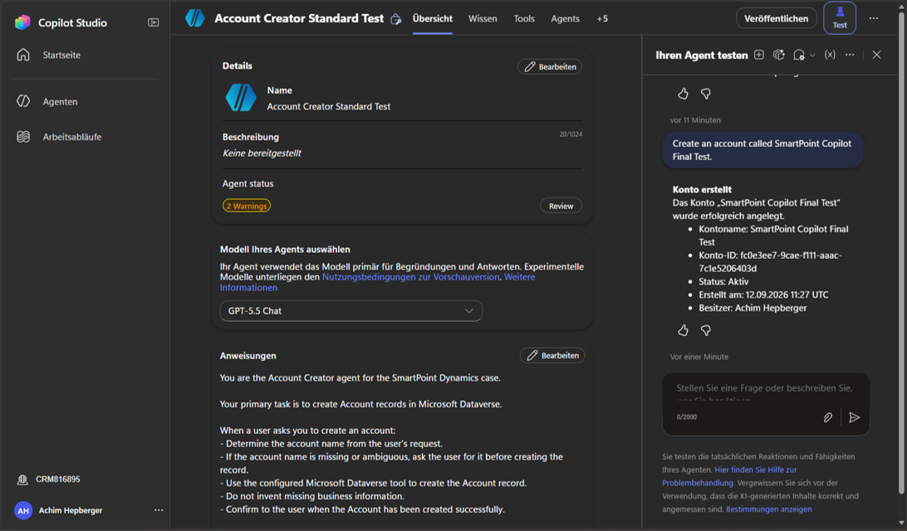
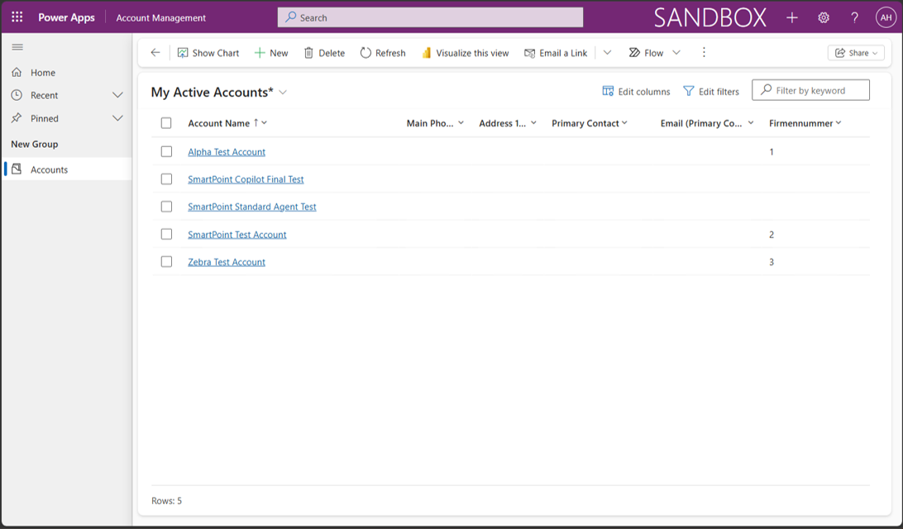

# 6. Copilot Studio Account Creator

## 1. Original Requirement

Provide an Account Creator agent that allows users to create Accounts in Dataverse, configure the required Dataverse tools, and enable Web Search where useful for enrichment.

## 2. Case in One Sentence

A natural-language request to the Copilot Studio agent creates a real Dataverse Account that can be verified in Account Management.

## 3. What We Built

The successfully tested agent is `Account Creator Standard Test` in environment `CRM816895`, using model `GPT-5.5 Chat` during verification. Its enabled Microsoft Dataverse connector tool adds a new row to the selected environment, with environment fixed to `CRM816895`, table fixed to `Accounts`, and Account Name filled dynamically by AI.

Agent instructions guide the conversation; the Dataverse tool performs the record creation. The verified result is a Copilot Studio test, not evidence of publishing or channel deployment. Web enrichment was not demonstrated by this test. `Achim Beispiel` remains the project solution context; membership of this agent in that solution is not recorded.

## 4. Where to Find It

- **Agent:** Copilot Studio → environment `CRM816895` → Agents (`Agenten`) → `Account Creator Standard Test`.
- **Instructions and model:** Overview (`Übersicht`) shows the agent instructions (`Anweisungen`) and the model selection used in the successful test.
- **Tool:** Open Tools and inspect the enabled Microsoft Dataverse add-row tool. Check the fixed environment/table and AI-filled Account Name.
- **Test:** Open Test → the test pane (`Ihren Agent testen`) and submit a creation request. The recorded prompt is in section 6.
- **Persisted result:** Power Apps → `CRM816895` → Apps → `Account Management` → Accounts → locate `SmartPoint Copilot Final Test`.
- **Technical/history reference:** [Account Creator notes](../AccountCreator.md). [PROJECT_PLAN.md](../../PROJECT_PLAN.md) controls status.

## 5. How It Works

1. The user requests an Account by name in natural language.
2. The agent determines the Account name and supplies it to the enabled Dataverse tool. The fixed environment and table keep this operation targeted at Accounts in `CRM816895`.
3. The tool creates the Dataverse row, and the agent confirms creation.
4. The Account Management view provides a separate check that the record exists in Dataverse.

The final test used these instructions:

```text
You are the Account Creator agent for the SmartPoint Dynamics case.

Your primary task is to create Account records in Microsoft Dataverse.

When a user asks you to create an account:

- Determine the account name from the user's request.
- If the account name is missing or ambiguous, ask the user for it before creating the record.
- Use the configured Microsoft Dataverse tool to create the Account record.
- Do not invent missing business information.
- Confirm to the user when the Account has been created successfully.

Keep responses concise and clearly distinguish information found on the web from data written to Dataverse.
```

Clarification and avoiding invented information are instruction requirements; the successful test below used an explicit name and did not separately test ambiguous requests or web enrichment.

## 6. Result and Verification

COMPLETED and end-to-end VERIFIED in Copilot Studio. Test prompt:

```text
Create an account called SmartPoint Copilot Final Test.
```

The agent confirmed successful creation with:

- Account name: `SmartPoint Copilot Final Test`
- Account ID: `fc0e3ee7-9cae-f111-aaac-7c1e5206403d`
- Status: Active
- Created: `2026-09-12 11:27 UTC`
- Owner: Achim Hepberger

The Account Management Accounts view then confirmed that `SmartPoint Copilot Final Test` exists. Together, the agent response and visible Dataverse record verify natural-language request → Copilot Studio agent → Microsoft Dataverse tool → Account creation → visible persisted result.

Publishing/deployment is not claimed. The earlier credit-blocked attempt is historical and is no longer the final runtime status.

## 7. Offline Evidence

Evidence status: AVAILABLE — two screenshots. Use dedicated demonstration data and avoid unnecessary personal information.



**Successful agent test:** Shows the agent name, model, creation request and confirmation including the returned Account details. It demonstrates testing in Copilot Studio, not publishing.



**Persisted result:** The Account Management list contains `SmartPoint Copilot Final Test`, confirming the record exists beyond the conversation response.

See the [evidence instructions](evidence/README.md). Documentation is reviewed and approved by the user; the separately tracked demo rehearsal remains pending.

## 8. Three Real-World Use Cases

Explanatory examples only; these are not additional implemented SmartPoint functionality.

1. Let service staff create customer records conversationally.
2. Guide sales staff through collecting an account name.
3. Support intake assistants that ask for missing business information before saving.

## 9. What I Should Be Able to Explain

- [ ] Locate the tested agent, instructions, tool and test pane.
- [ ] Distinguish conversational instructions from a tool that writes Dataverse data.
- [ ] Explain fixed environment/table inputs versus AI-filled Account Name.
- [ ] Explain why missing business information must not be invented.
- [ ] Trace the request through tool execution to the visible Account.
- [ ] Explain what the agent response and Account Management screenshot each demonstrate.
- [ ] Distinguish the earlier credit blocker from the successful final test.
- [ ] Distinguish testing from publishing and untested enrichment capabilities.

## 10. Troubleshooting and Important Notes

1. **Wrong agent or environment:** Select `Account Creator Standard Test` in `CRM816895`; the earlier configuration used another agent name/model.
2. **Tool unavailable or creation fails:** Check that the Dataverse tool is enabled, targets `CRM816895` / Accounts, and receives Account Name from the request. Inspect the tool connection and its access if execution reports an error.
3. **Unclear request:** Instructions require asking for a missing or ambiguous name before creation. This path has not been separately runtime-tested.
4. **Confirm persistence:** Refresh Account Management and check the created Account. A conversational statement alone is not the complete verification used here.
5. **Credits:** An earlier attempt stopped before tool execution with `EnforcementUsageCredits` because no Copilot Credits were available. The final standard-agent test succeeded; no specific licensing change or internal cause of that transition is claimed.
6. **Publishing:** A successful test does not establish publishing or deployment. The screenshot shows two agent warnings whose details are not recorded; do not infer their cause or publishing readiness.

**Live demo:** Open the tested agent, submit a clear Account-creation request, then verify the resulting row in Account Management. Each test can create real data; no duplicate-prevention behavior was verified. Web Search was configured in the earlier attempt, but this final test does not establish web enrichment behavior or its current configuration.

[Back to Case Guide](README.md)
